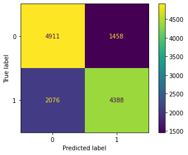

# Cardiovascular Disease classification for health company prediction - by Tomi Prasetyo

## Domain Proyek

Menurut data dari WHO (World Health Organization), kardiovaskular atau penyakit yang berhubungan dengan jantung dan pembuluh darah merupakan penyebab kematian terbanyak di seluruh dunia. Pada tahun 2019 ada sekitar 17,9 juta orang meninggal karena kardiovaskular(https://www.who.int/news-room/fact-sheets/detail/cardiovascular-diseases-(cvds)). Sedangkan di Indonesia sendiri, menurut data dari Riset Kesehatan Dasar(Riskesdas) yang di kutip dari kementerian kesehatan, Setidaknya, 15 dari 1000 orang, atau sekitar 2.784.064 individu di Indonesia menderita penyakit jantung(http://p2ptm.kemkes.go.id/kegiatan-p2ptm/pusat-/hari-jantung-sedunia-world-heart-day-your-heart-is-our-heart-too).
Berdasarkan data tersebut tentu diperlukan deteksi dini untuk menangantisipasi peningkatan penyakit jantung pada pasien, yang nantinya dapat digunakan oleh perusahaan yang bergerak di bidang kesehatan maupun rumah sakit, sehingga bisa dilakukan tindakan pencegahan dan perawatan.

## Bussiness Understanding

Tentu saat ini rumah sakit sudah dilengkapi dengan alat yang dapat untuk merekam data berbagai kondisi dari pasien.
Dengan data yang banyak dari berbagai rumah sakit maupun institusi yang tersedia di internet dapat digunakan untuk menyusun algoritma machine learning dalam hal klasifikasi apakah kemungkinan seorang pasien mempunyai peluang untuk memiliki masalah jantung dan pembuluh darah.

Dengan sebuah sistem prediksi yang akurat, dapat meningkatkan kepercayaan pasien terhadap perusahaan yang bergerak di bidang kesehatan tersebut. Semakin banyak pasien yang mempercayakan kesehatannya kepada perusahaan tersebut, maka income pada perusahaan tersebut akan semakin besar pula.

### Problem Statement

Berdasarkan penjelasan diatas, perusahaan yang bergerak di bidang kesehatan dapat membuat sebuah sistem prediksi untuk mengklasifikasikan kemungkinan seorang pasien menderita kardiovaskular, dan bisa menjawab permasalahan berikut :

- dari semua fitur yang ada fitur apa saja yang punya faktor terbesar sesorang mengidap kardiovaskular?
- Apakah seseorang dengan data kesehatan tertentu diprediksi mempunyai resiko kardiovaskular?

### Goals

Untuk menjawab pertanyaan tersebut, saya akan membuat klasifikasi modelling dengan tujuan atau goals sebagai berikut:

- mengetahui fitur yang berrelasi terhadap klasifikasi kemungkinan kardiovaskular atau tidak.
- Membuat model machine learning yang dapat mengklasifikasikan apakah sesorang kemungkinan dapat mengidap kardiovaskular dengan seakurat mungkin berdasarkan fitur-fitur yang ada.

### Solution Statement

Pada kasus ini, saya akan membuat sebuah sistem prediksi untuk kalsifikasi dengan memnfaatkan algoritma machine learning Random Forest.

Random Forest adalah termasuk kedalam kelompok ensemble, dimana didalamnya terdapat bebrapa kelompok model machine learning sederhana yang secara bersama-sama menghasilkan model yang lebih powerfull.

- model yang akan saya pakai adalah Random Forest Classifier karena kita akan melakukan proses klasifikasi. Model ini pada dasarkan terdiri dari beberapa model Decision Tree(Pohon Keputusan), dimana keluaran dari model diambil dari keluaran mana yang terbanyak.
- Pada model saya mengadopsi teknik Bagging, dimana setiap model Decision Tree akan mengambil fitur secara acak dan setiap model akan menghasilkan keluaran yang berbeda.

## Data Understanding

Data yang akan saya gunakan dalam proyek ini merupakan data yang didapat dari berbagai pengecakan medis dan tersedia secara bebas di situs dataset kaggle (https://www.kaggle.com/sulianova/cardiovascular-disease-dataset)

Dataset ini terdiri dari 70.000 data dengan 11 feature dan 1 label sebagai berikut:

### Feature

terdiri dari dua jenis data, yaitu data numerik dan data kategori.

data numerik meliputi : id, age, height, weight, ap_hi dan ap_lo,

sedangkan data kategori meliputi : gender, cholesterol, gluc, alco, active

Berikut penjelasan detail dari feature pada dataset

- id : nomor urut pasien
- age : merupakan umur pasien (dalam satuan hari)
- height : merupakan tinggi pasien (dalam satuan sentimeter)
- weight : merupakan berat badan pasien (dalam satuan kilogram)
- Gender : merupakan jenis kelamin pasien
- ap_hi : merupakan tekanan darah sistolik (dalam satuan mmHg)
- ap_lo : merupakan tekanan darah diastolik (dalam satuan mmHg)
- cholesterol : merupakan kadar kolesterol dalam kategori, yaitu normal, diatas normal dan jauh diatas normal
- gluc : merupakan kadar glucosa dalam kategori, yaitu normal, diatas normal dan jauh diatas normal
- smoke : merupakan data kategori apakah pasien merokok atau tidak
- alco : merupakan data kategori apakah pasien sering mengkonsumsi alkohol atau tidak
- active : merupakan data kategori apakah pasien sering bergerak atau tidak

### Label

Label disini merupakan satu kolom dengan nama kolom "cardio".

Terdiri dari data kategori 0 dan 1, dimana 0 adalah "no cardio (kemungkinan tidak kardiovaskular)" dan 1 adalah "cardio (kemungkinan akan mempunyai kardiovaskular)".

## Data Preparation

- Menghilangkan kolom id, karena kolom id tidak ada korelasi dengan proses klasifikasi.

- Melakukan proses encoding pada data tipe kategori. Ini bertujuan untuk mempermudah model dalam memproses data.
  Sebelumnya pada data kategori, yaitu cholesterol, gluc, smoke, alco, dan active terdiri dari dua maupun tiga kategori dalam satu kolom. dengan encoding kita akan membuat masing masing kategori menjadi kolom baru, dan kolom yang memuat kategori tersebut akan bernilai 1, sedangkan yang tidak akan bernilai 0.
  Dengan encoding diharapkan nantinya akan memudahkan model untuk melakukan proses training dan evaluasi.
  pada scikit learn tersedia fitur OneHotEncoder yang berguna untuk melakukan proses encoding.
  ini data sebelum proses encoding :
  

    
  Dan ini adalah data setelah proses encoding :
  

- Melakukan Standarisasi. Setelah melakukan proses encoding pada setiap data kategori maka akan membentuk nilai 1 dan 0 pada masing masing kategori, selanjutnya saya melakukan proses standarisasi pada data numerik.
  Standardisasi adalah teknik transformasi yang paling umum digunakan dalam tahap persiapan pemodelan. Untuk data numerik, kita tidak akan melakukan transformasi dengan one-hot-encoding seperti pada fitur kategori. Kita akan menggunakan teknik StandarScaler dari library Scikitlearn.
  StandardScaler melakukan proses standarisasi fitur dengan mengurangkan mean (nilai rata-rata) kemudian membaginya dengan standar deviasi untuk menggeser distribusi. StandardScaler menghasilkan distribusi dengan standar deviasi sama dengan 1 dan mean sama dengan 0. Sekitar 68% dari nilai akan berada di antara -1 dan 1.

data sebelum proses standarisasi :

data setelah standarisasi :

Dengan melakukan encoding pada data kategori dan standarisasi pada data numerik diharapkan algoritma machine learning akan lebih cepat dan efisien karena data kita berada pada distribusi normal atau berada pada rentang yang sama.

## Modelling and Training

Pertama Saya membagi data menjadi dua jenis yaitu data train dan data test.
data train akan saya gunakan pada tahap training, dan data test akan saya gunakan pada tahap evaluasi.
Proses membagi data menggunakan fungsi train_test_split dari library scikit learn.

Karena disini adalah mengklasifikasikan apakah pasien ada kemungkinan mengidap kardiovaskular maka saya menggunakan algoritma klasifikasi dari Random Forest Classifier dari scikit learn.
Random Forest bisa dipakai untuk klasifikasi maupun regresi. Random Forest termasuk kedalam kelompok ensemble(group). model ensemble adalah kelompok model yang terdiri dari beberapa model yang bekerja secara bersama-sama. Dari setiap model yang ada didalam kelompok ensemble ini akan membuat prediksi secara independen sehingga prediksi dari satu model dengan model yang lain tentu akan berbeda. Prediksi dari setiap model ini akan digabungkan untuk menjadi prediski akhir model nesemble.

ada 2 pendekatan dalam model ensemble, yaitu bagging dan boosting. teknik bagging sangat cocok untuk model Decision Tree. Karena sejatinya Random Forest tersusun atas kumpuan dari model Decision Tree maka, model ini akan memakai teknik bagging. Bagging atau bootstrap aggregating adalah teknik yang melatih model dengan sampel random. Dalam teknik bagging, sejumlah model dilatih dengan teknik sampling with replacement (proses sampling dengan penggantian). Ketika kita melakukan sampling with replacement, sampel dengan nilai yang berbeda bersifat independen. Artinya, nilai suatu sampel tidak mempengaruhi sampel lainnya. Akibatnya, model yang dilatih akan berbeda antara satu dan lainnya.

Berikut adalah ilustrasi dari teknik bagging :

dapat kita lihat bahwa dari setiap model akan memilih data yang berbeda satu sama lain.
Hasil prediksi akhir adalah jumlah terbanyak yang diprediksi oleh kumpulan model Decision Tree.

Pada tahap training saya mendapatkan akurasi, saya menggunakan metrik accurasi score dari scikit learn dan didapatkan akurasi sebesar 0,82, dan untuk menghitung loss saya menggunakan metrik mean squared error dan didapatkan error sebesar 0,17.

Mengenai metrics acurracy_score dan mean_squared_error akan saya jelaskan pada tahap evaluasi.

## Evaluasi

Pada tahap evaluasi saya memakai data test yang berbeda dengan data training.

metrik evaluasi yang digunakan juga sama seperti pada tahap training yaitu memakai metrik accurasi score dan untuk menghitung loss menggunakan metrik mean squared error.

- Accuracy_score adalah sebuah metric evaluasi dengan membandingkan jumlah prediksi yang benar dengan jumlah keseluruhan data.
  Jika kita melihat pada tabel confusion metric berikut :

dapat kita lihat ada 2 label, yaitu true label (label yang sesungguhnya) dan predicted label (label yang diprediksi oleh model). Accuracy_score akan membandingkan jumlah label 1 yang diprediksi 1 ditambah jumlah label 0 yang diprediksi 0 di bagi jumlah keseluruhan data. Berikut adalah rumusnya :

Dimana TP adalah label 1 yang diprediksi 1, dan TN adalah label 0 yang diprediksi 0.

- mean_squared_error adalah sebuah metric yang digunakan untuk mengukur seberapa besar error / kesalahan dalam prediksi. Semakin kecil error maka performa dari model semakin baik. mean_squared_error akan menghitung selisih rata-rata nilai sebenarnya dengan nilai prediksi. Berikut rumusnya :
  

Dengan metric tersebut didapatkan akurasi sebesar 0,72 dan loss sebesar 0,27.

## Penutup

Demikian adalah rangkuman dari tahapan Prediksi penyakit kardiovaskular yang saya lakukan. Prediksi masih bisa diperbaiki dengan melakukan hypertuning parameter ataupun memperbaiki dengan memeperbaiki kualitas data.
